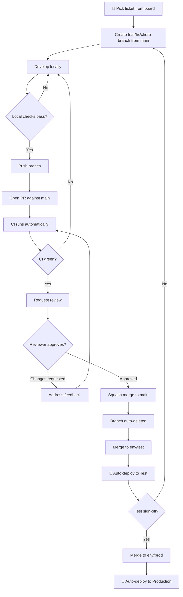

# Day-to-Day Development Workflow

This guide covers the full development cycle at Datean Technology — from picking up
a ticket to seeing your code live in production.

---

## Table of Contents

1. [Flow Overview](#flow-overview)
2. [Step 1 — Pick Up a Ticket](#step-1--pick-up-a-ticket)
3. [Step 2 — Create a Branch](#step-2--create-a-branch)
4. [Step 3 — Develop and Commit](#step-3--develop-and-commit)
5. [Step 4 — Open a Pull Request](#step-4--open-a-pull-request)
6. [Step 5 — Code Review](#step-5--code-review)
7. [Step 6 — Addressing Feedback](#step-6--addressing-feedback)
8. [Step 7 — Merging](#step-7--merging)
9. [Step 8 — After Merge](#step-8--after-merge)
10. [Deploying to Production](#deploying-to-production)

---

## Flow Overview



---

## Step 1 — Pick Up a Ticket

1. Open the **Engineering Backlog** project board on GitHub.
2. Find a ticket in the **Ready** column that is unassigned (or assigned to you).
3. Read the ticket fully — acceptance criteria, linked designs, and any comments.
4. If anything is unclear, comment on the ticket before starting.
5. Move the ticket to **In Progress** and assign it to yourself.

> 💡 Only take one or two tickets at a time. Context-switching slows everyone down.

---

## Step 2 — Create a Branch

Always branch from a fresh `main`:

```bash
git checkout main
git pull origin main

# Create your branch
git checkout -b feat/DT-142-user-auth-flow
# or
git checkout -b fix/DT-209-checkout-redirect-loop
# or
git checkout -b chore/DT-301-bump-nextjs-14
```

### Branch naming rules

| Prefix | Use for |
|--------|---------|
| `feat/` | New features |
| `fix/` | Bug fixes |
| `chore/` | Dependencies, config, tooling |
| `docs/` | Documentation-only changes |

Format: `<prefix>/<ticket-id>-<short-description-in-kebab-case>`

---

## Step 3 — Develop and Commit

Write your code. Commit early and often — you'll squash everything into one commit at merge.

### Commit message format

```
<type>(<scope>): <short description in imperative mood>
```

```bash
# Adding a feature
git commit -m "feat(auth): add JWT refresh token endpoint"

# Fixing a bug
git commit -m "fix(checkout): resolve redirect loop on expired session"

# Updating dependencies
git commit -m "chore: bump next to 14.2.3"

# Fixing a test
git commit -m "test(auth): add coverage for expired token case"
```

See [CONTRIBUTING.md](../CONTRIBUTING.md#commit-message-format) for the full type list.

### Before pushing — run local checks

**Next.js:**
```bash
npm run lint
npm run typecheck
npm run test
npm run build   # catch build-time errors early
```

**Python SAM:**
```bash
source .venv/bin/activate
make lint
make test
```

**Flutter:**
```bash
flutter analyze
flutter test
```

Fix all errors and warnings before pushing. CI will catch the same issues — save yourself
a round-trip.

---

## Step 4 — Open a Pull Request

```bash
# Push your branch
git push -u origin feat/DT-142-user-auth-flow

# Open a PR using the gh CLI
gh pr create --base main --title "feat(auth): add JWT refresh token flow"
```

Or open it in the browser — GitHub will prompt you after your push.

### PR checklist before submitting

- [ ] PR title is a valid Conventional Commit message
- [ ] Description filled in using the PR template
- [ ] Ticket linked (`Closes #142` in the description)
- [ ] At least one reviewer assigned (check `CODEOWNERS` if unsure)
- [ ] No debug code, `console.log`, or temporary hacks left in
- [ ] No hardcoded secrets or credentials
- [ ] Screenshot/recording attached for any UI changes

---

## Step 5 — Code Review

Once CI is green, your reviewer will look at the PR. Review SLA: **one working day**.

As an author, while waiting:
- Don't merge anything unrelated into your branch
- Monitor the CI run in the **Actions** tab
- Reply to any early comments promptly

---

## Step 6 — Addressing Feedback

When a reviewer leaves comments:

1. Read every comment before changing anything — some comments may be related.
2. For each comment, either:
   - Make the change and reply "Done" (or paste the updated snippet)
   - Explain why you disagree and propose an alternative — don't just ignore it
3. Push your changes — CI re-runs automatically.
4. Re-request review using the 🔁 icon next to the reviewer's name.

```bash
# Make changes, then:
git add .
git commit -m "fix(auth): address review feedback — use httpOnly cookie"
git push
```

Do **not** force-push after a review has started — it makes the diff history unreadable.
Use additional commits; they'll be squashed at merge anyway.

---

## Step 7 — Merging

Once you have:
- ✅ At least 1 approval
- ✅ All CI checks green
- ✅ No unresolved conversations

Click **"Squash and merge"** on the PR.

**Set the squash commit message correctly:**

```
feat(auth): add JWT refresh token flow (#142)
```

It must be a valid Conventional Commit. GitHub pre-fills this from your PR title — check it.

> You may be able to enable auto-merge (`gh pr merge --auto --squash`) so the PR merges
> automatically when all checks and approvals are satisfied.

---

## Step 8 — After Merge

### Immediately after merge

- Your branch is **automatically deleted**.
- Move the ticket to **Done** on the project board.
- If it's a `fix:` for a production issue, notify the relevant team.

### Deploying to Test

To deploy your change to the test environment:

```bash
# Checkout env/test and merge main into it
git checkout env/test
git pull origin env/test
git merge origin/main --squash
git commit -m "chore: deploy to test — <describe what's included>"
git push origin env/test
```

This triggers the **test deployment workflow** automatically. Watch it in **Actions**.

> 💡 In most repos this is handled by the team lead or platform-leads on a regular cadence.
> Check your repo's workflow docs or Slack channel before doing this yourself.

---

## Deploying to Production

**Only deploy to production after test sign-off.**

1. Raise a PR from `main` → `env/prod` (or ask your team lead to do so).
2. The `production` GitHub Environment requires 1 reviewer from `platform-leads`.
3. Once approved and merged, the **production deployment workflow** fires automatically.
4. Monitor the deployment in **Actions** until it reaches "success".
5. Do a quick smoke-test on the live URL.
6. Announce in the team channel: `✅ DT-142 deployed to production`.

---

## Quick Reference Card

```
main ──────────────────────────────────────────► (source of truth)
  │
  ├─ feat/DT-142-*  (PR → main, squash merge)
  │
  ├─ env/test  ──► CI ──► Auto-deploy to Test
  │                ↑
  │           merge from main
  │
  └─ env/prod  ──► CI + approval ──► Auto-deploy to Production
                   ↑
              merge from main
```
```

---
